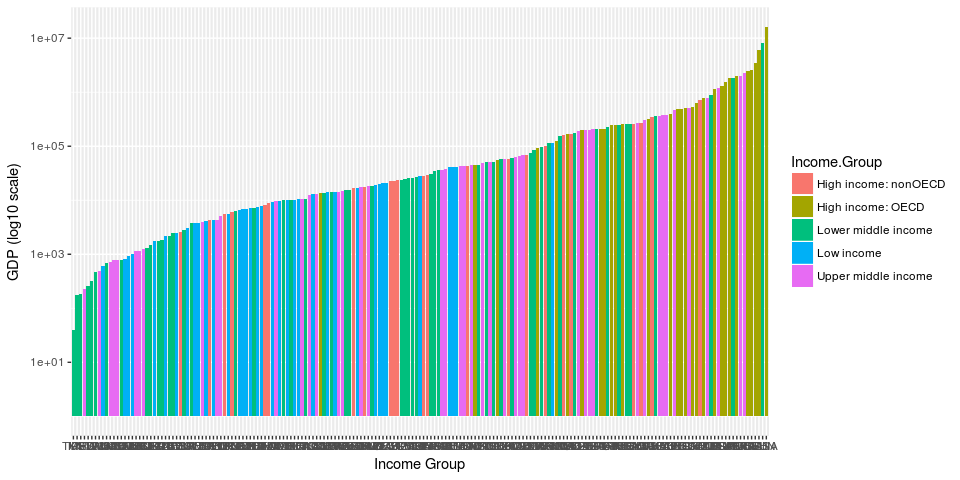
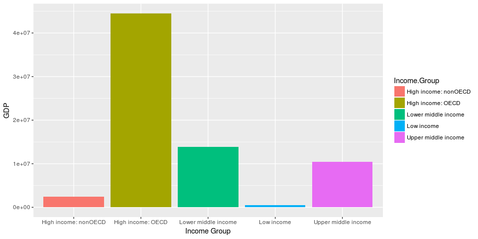
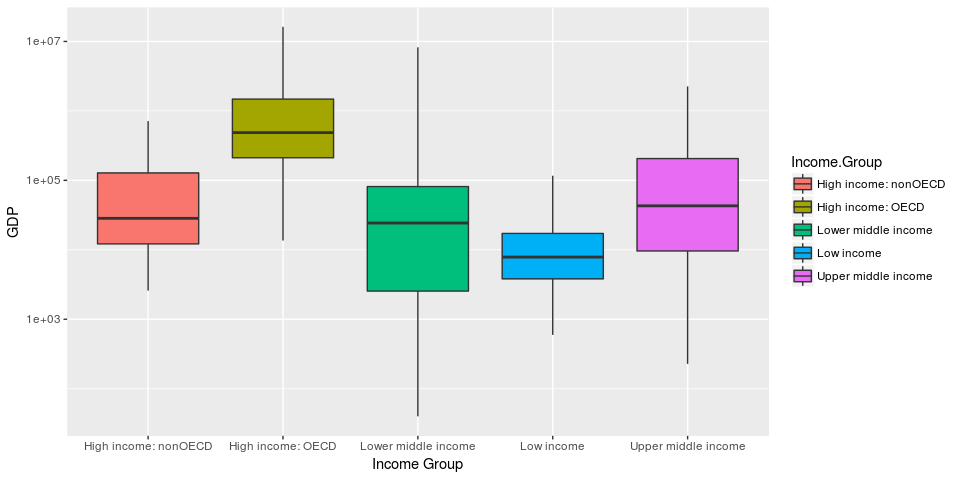

Introduction
------------

The analysis presented in this presentation is based upon Gross Domestic Product (GDP) and Educational Statistics data freely available from the World Bank (<http://data.worldbank.org/data-catalog>). The GDP Ranking data is a simple data set containing actual GDP and a ranking of 190 different countries. The Educational Statistics data contains core education indicators from the UNESCO Institute for Statistics (UIS). This document describes the methods implemented to import, cleanse, merge and analzye the GDP and Eductational Statistics data sets.

Code
----

All coding for this analysis was created using R Studio to create R Script files. A single R Make-like file named "Makefile.R" was created to execute the data import, cleansing and analysis processes. The code can be sourced by "Makefile.R" and is divided into four different R script files: CS1loadLibraries.R, CS1DLoadandRead.R, CS1CleanseData.R and CS1AnalyzeData.R. Additional details for each R script file are presented below.

### Libraries

In addition to base R libraries and packages, downloader, dyplr and ggplot2 are loaded to assist with data importing, cleansing and analysis.

``` r
source("CS1LoadLibraries.R")
```

### Data Import

The data is donwloaded directly from the World Bank data catalog. After the data is successfully downloaded to the R project's working directory, two data frames are created for use within the R scripts: GDPdata and FedStats.

``` r
source("CS1DLoadandRead.R")
head(GDPdata)
```

    ##    V1 V2 V3             V4           V5 V6 V7 V8 V9 V10
    ## 1 USA  1 NA  United States  16,244,600     NA NA NA  NA
    ## 2 CHN  2 NA          China   8,227,103     NA NA NA  NA
    ## 3 JPN  3 NA          Japan   5,959,718     NA NA NA  NA
    ## 4 DEU  4 NA        Germany   3,428,131     NA NA NA  NA
    ## 5 FRA  5 NA         France   2,612,878     NA NA NA  NA
    ## 6 GBR  6 NA United Kingdom   2,471,784     NA NA NA  NA

``` r
head(FedStats)
```

    ##   CountryCode                    Long.Name         Income.Group
    ## 1         ABW                        Aruba High income: nonOECD
    ## 2         ADO      Principality of Andorra High income: nonOECD
    ## 3         AFG Islamic State of Afghanistan           Low income
    ## 4         AGO  People's Republic of Angola  Lower middle income
    ## 5         ALB          Republic of Albania  Upper middle income
    ## 6         ARE         United Arab Emirates High income: nonOECD
    ##                       Region Lending.category Other.groups  Currency.Unit
    ## 1  Latin America & Caribbean                                Aruban florin
    ## 2      Europe & Central Asia                                         Euro
    ## 3                 South Asia              IDA         HIPC Afghan afghani
    ## 4         Sub-Saharan Africa              IDA              Angolan kwanza
    ## 5      Europe & Central Asia             IBRD                Albanian lek
    ## 6 Middle East & North Africa                                U.A.E. dirham
    ##   Latest.population.census  Latest.household.survey
    ## 1                     2000                         
    ## 2           Register based                         
    ## 3                     1979               MICS, 2003
    ## 4                     1970 MICS, 2001, MIS, 2006/07
    ## 5                     2001               MICS, 2005
    ## 6                     2005                         
    ##                                                                 Special.Notes
    ## 1                                                                            
    ## 2                                                                            
    ## 3 Fiscal year end: March 20; reporting period for national accounts data: FY.
    ## 4                                                                            
    ## 5                                                                            
    ## 6                                                                            
    ##   National.accounts.base.year National.accounts.reference.year
    ## 1                        1995                               NA
    ## 2                                                           NA
    ## 3                   2002/2003                               NA
    ## 4                        1997                               NA
    ## 5                                                         1996
    ## 6                        1995                               NA
    ##   System.of.National.Accounts SNA.price.valuation
    ## 1                          NA                    
    ## 2                          NA                    
    ## 3                          NA                 VAB
    ## 4                          NA                 VAP
    ## 5                        1993                 VAB
    ## 6                          NA                 VAB
    ##   Alternative.conversion.factor PPP.survey.year
    ## 1                                            NA
    ## 2                                            NA
    ## 3                                            NA
    ## 4                       1991-96            2005
    ## 5                                          2005
    ## 6                                            NA
    ##   Balance.of.Payments.Manual.in.use External.debt.Reporting.status
    ## 1                                                                 
    ## 2                                                                 
    ## 3                                                           Actual
    ## 4                              BPM5                         Actual
    ## 5                              BPM5                         Actual
    ## 6                              BPM4                               
    ##   System.of.trade Government.Accounting.concept
    ## 1         Special                              
    ## 2         General                              
    ## 3         General                  Consolidated
    ## 4         Special                              
    ## 5         General                  Consolidated
    ## 6         General                  Consolidated
    ##   IMF.data.dissemination.standard
    ## 1                                
    ## 2                                
    ## 3                            GDDS
    ## 4                            GDDS
    ## 5                            GDDS
    ## 6                            GDDS
    ##   Source.of.most.recent.Income.and.expenditure.data
    ## 1                                                  
    ## 2                                                  
    ## 3                                                  
    ## 4                                         IHS, 2000
    ## 5                                        LSMS, 2005
    ## 6                                                  
    ##   Vital.registration.complete Latest.agricultural.census
    ## 1                                                       
    ## 2                         Yes                           
    ## 3                                                       
    ## 4                                                1964-65
    ## 5                         Yes                       1998
    ## 6                                                   1998
    ##   Latest.industrial.data Latest.trade.data Latest.water.withdrawal.data
    ## 1                     NA              2008                           NA
    ## 2                     NA              2006                           NA
    ## 3                     NA              2008                         2000
    ## 4                     NA              1991                         2000
    ## 5                   2005              2008                         2000
    ## 6                     NA              2008                         2005
    ##   X2.alpha.code WB.2.code           Table.Name           Short.Name
    ## 1            AW        AW                Aruba                Aruba
    ## 2            AD        AD              Andorra              Andorra
    ## 3            AF        AF          Afghanistan          Afghanistan
    ## 4            AO        AO               Angola               Angola
    ## 5            AL        AL              Albania              Albania
    ## 6            AE        AE United Arab Emirates United Arab Emirates

The code used to import the source data into R data frames is shown below. It is commented out as is has already been executed in the preceeding chunk.

``` r
# Dowload GDP and educational data
#download("https://d396qusza40orc.cloudfront.net/getdata%2Fdata%2FGDP.csv", destfile = "GDPdata.csv")
#download("https://d396qusza40orc.cloudfront.net/getdata%2Fdata%2FEDSTATS_Country.csv", destfile = "FEDSTATS.csv")

# Read CSV Data 
#GDPdata <- read.csv("GDPdata.csv", stringsAsFactors = FALSE, header = FALSE, skip = 5, skipNul = TRUE)
#FedStats <- read.csv("FEDSTATS.csv", stringsAsFactors = FALSE, header = TRUE)
```

### Data Cleansing and Merging

The data cleansing and merging script prepares the GDP and Educational Statistics data for analysis. The script begins by deleting blank columns from the GDP data.

``` r
#delcols <- c(3, 7:10)
#GDPdata <- subset(GDPdata, select=-delcols)
```

GDP data columns are then renamed to enhance readability of the data frame and future code.

``` r
#GDPdata <- rename(GDPdata, CountryCode = V1, Ranking = V2, Economy = V4, GDP_USD = V5)
```

The GDP data also has several rows with a blank country code. These rows are removed.

``` r
#GDPdata <- subset(GDPdata, CountryCode != "")
```

GDP data columns are then coerced to the correct data types to allow for accurate analysis.

``` r
#GDPdata$CountryCode <- as.factor(GDPdata$CountryCode)
#GDPdata$Ranking <- as.integer(GDPdata$Ranking)
#GDPdata$GDP_USD <- gsub(",", "", GDPdata$GDP_USD)
#GDPdata$GDP_USD <- as.numeric(GDPdata$GDP_USD)
```

The GDP data also contains two different sets of data in the same file. Rows 1 through 217 contain GDP rankings. The rows higher than 217 contain GDP by income group. An income group data frame is created for future analysis. GDP data is subset to only include just GDP data at a country code level. The resulting data frame is named "JustGDPdata".

``` r
#IncomeGroup <- subset(GDPdata, as.numeric(rownames(GDPdata)) > 217)
#JustGDPdata <- subset(GDPdata, as.numeric(rownames(GDPdata)) <= 217 & CountryCode != 'WLD')
#IncomeGroup <- rename(IncomeGroup, IG_GDP_USD = GDP_USD)
#
#IncomeGroup <- subset(IncomeGroup, select = -(c(2,5)))
```

The Educational Statistics are fairly clean. "FedStats" is merged with "JustGDPdata" to create a consolidated data fram named "MergeGDPandStat". This will be the primary data frame used for analysis. The number of matches during the merge is recorded and displayed. "MergeGDPandStat" is then subset of include on those rows with a GDP Ranking. Question 1 is also answered in this section and stored in the variable named Q1 for future reference.

``` r
#MergeGDPandStat <- merge(JustGDPdata, FedStats, by="CountryCode")
#Q1 <- nrow(MergeGDPandStat)
#cat("There are", nrow(MergeGDPandStat), "matches between GDPdata and FedSTATS.")
#MergeGDPandStat <- subset(MergeGDPandStat, complete.cases(MergeGDPandStat$Ranking) == TRUE)
```

The entire data cleansing script is sourced in the following chunk.

``` r
source("CS1CleanseData.R")
head(MergeGDPandStat)
```

### Data Analysis

The data analysis section addresses the data analysis requirements specified in the Case Study document. The analysis script begins by sorting "MergeGDPandStat" by GDP ascending. The country with the 13th lowest GDP is then identified. The average GDP rankings for the "High income: OECD" and "High income: nonOECD" income groups is calculated. A bar chart showing GDP per Income Group is then created and printed. Next, each row is assigned a quantile group based upon GDP ranking. The number of countries which are in the top 38 GDP Rankings and part of the "Lower middle income" income group.

``` r
source("CS1AnalyzeData.R")
```

#### Questions and Answers

Question 1. Merge the data based on the country shortcode. How many of the IDs match?

``` r
cat("There are", Q1, "matches between GDPdata and FedSTATS.")
```

    ## There are 210 matches between GDPdata and FedSTATS.

Question 2. Sort the data frame in ascending order by GDP (so United States is last). What is the 13th country in the resulting data frame?

``` r
cat(MergeGDPandStat$Long.Name[13], "is the country with the 13th lowest GDP.  ")
```

    ## St. Kitts and Nevis is the country with the 13th lowest GDP.

Question 3. What are the average GDP rankings for the "High income: OECD" and "High income: nonOECD" groups?

``` r
cat("The mean GDP ranking for High income: OECD countries is", mean(HIOECDGDP$Ranking), ".  ")
```

    ## The mean GDP ranking for High income: OECD countries is 32.96667 .

``` r
cat("The mean GDP ranking for High income: nonOECD countries is", mean(HINOECDGDP$Ranking, na.rm = TRUE), ".  ")
```

    ## The mean GDP ranking for High income: nonOECD countries is 91.91304 .

Question 4. Plot the GDP for all of the countries. Use ggplot2 to color your plot by Income Group.

``` r
# A log10 scale is applied to the y axis to minimize the vizual impact of outliers on the bar graph.
ggplot(MergeGDPandStat, aes(x = reorder(MergeGDPandStat$CountryCode, MergeGDPandStat$GDP_USD), MergeGDPandStat$GDP_USD)) +geom_bar(stat = "identity", aes(fill = Income.Group)) +labs(x = "Income Group", y = "GDP (log10 scale)") +scale_y_continuous(trans = "log10")
```



Question 5. Cut the GDP ranking into 5 separate quantile groups. Make a table versus Income.Group. How many countries are Lower middle income but among the 38 nations with highest GDP?

``` r
Q5 <- subset(MergeGDPandStat, MergeGDPandStat$QuantileGroup=="1" & MergeGDPandStat$Income.Group=="Lower middle income")
cat(nrow(Q5), "countries are Lower middle income and among the 38 nations with highest GDP.  ")
```

    ## 4 countries are Lower middle income and among the 38 nations with highest GDP.

Conclusion
----------

The GPD and Educational Statistics data used as input into the project are of verying level of quality. The GDP data requires quite a bit of cleansing considering the limited number of columns. The World Bank should consider implementing the steps shown in the Data Cleansing portion of this project to reduce the amount of data engineering required to arrive at a usable data set. The Educational Statistics data set required minimal cleansing.

The analysis of the combined data sets focused on GDP amounts, GDP Rankings and Income Groups to answer the required questions. The data shows the vast majority of the worlds GDP is generated by 'High Income: OECD' countries. Surprisingly, 'Lower middle income' countries combine to produce a greater total GDP than countries in the 'Upper middle income' and 'High income: non OECD' income groups. The 'Lower middle income' group also contains the widest spread of GDP data. A bar graph showing total GDP by Income Group and a Boxplot of GDP by Income Group provide additional insight into the GDP data.

``` r
# Plot Bar Graph of Total GDP by Income Group. 
ggplot(MergeGDPandStat, aes(MergeGDPandStat$Income.Group, MergeGDPandStat$GDP_USD)) +geom_bar(stat = "identity", aes(fill = Income.Group)) +labs(x = "Income Group", y = "GDP")
```



``` r
#Plot boxplot of GDP by Income Group on a log10 scale
ggplot(MergeGDPandStat, aes(MergeGDPandStat$Income.Group, MergeGDPandStat$GDP_USD)) +geom_boxplot(aes(fill = Income.Group)) +labs(x = "Income Group", y = "GDP") +scale_y_log10()
```



Further analysis is necessary to determine the exact cause. The Educational Statistics data contains a variety of information that could provide addtional insight into the relationship between GDP and educational statistics.
